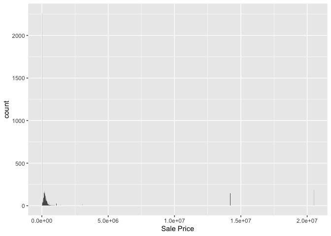
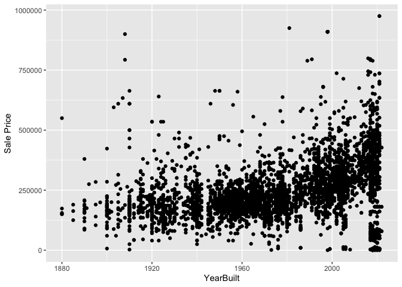
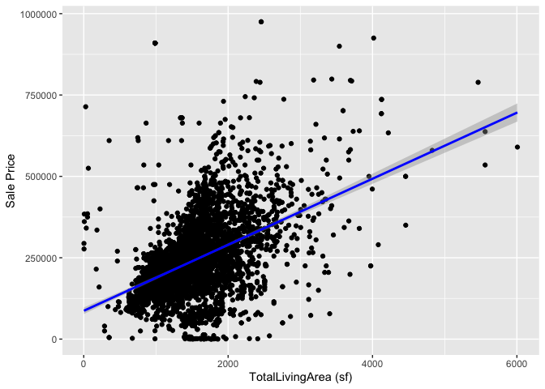

<!-- README.md is generated from README.Rmd. Please edit the README.Rmd file -->

# Lab report \#1

Follow the instructions posted at
<https://ds202-at-isu.github.io/labs.html> for the lab assignment. The
work is meant to be finished during the lab time, but you have time
until Monday evening to polish things.

Include your answers in this document (Rmd file). Make sure that it
knits properly (into the md file). Upload both the Rmd and the md file
to your repository.

All submissions to the github repo will be automatically uploaded for
grading once the due date is passed. Submit a link to your repository on
Canvas (only one submission per team) to signal to the instructors that
you are done with your submission.

``` r
library(classdata)
library(dplyr)
```

    ## 
    ## Attaching package: 'dplyr'

    ## The following objects are masked from 'package:stats':
    ## 
    ##     filter, lag

    ## The following objects are masked from 'package:base':
    ## 
    ##     intersect, setdiff, setequal, union

``` r
library(ggplot2)

data(ames)
summary(ames)
```

    ##   Parcel ID           Address                        Style     
    ##  Length:6935        Length:6935        1 Story Frame    :3732  
    ##  Class :character   Class :character   2 Story Frame    :1456  
    ##  Mode  :character   Mode  :character   1 1/2 Story Frame: 711  
    ##                                        Split Level Frame: 215  
    ##                                        Split Foyer Frame: 156  
    ##                                        (Other)          : 218  
    ##                                        NA's             : 447  
    ##                           Occupancy      Sale Date            Sale Price      
    ##  Condominium                   : 711   Min.   :2017-07-03   Min.   :       0  
    ##  Single-Family / Owner Occupied:4711   1st Qu.:2019-03-27   1st Qu.:       0  
    ##  Townhouse                     : 745   Median :2020-09-22   Median :  170900  
    ##  Two-Family Conversion         : 139   Mean   :2020-06-14   Mean   : 1017479  
    ##  Two-Family Duplex             : 182   3rd Qu.:2021-10-14   3rd Qu.:  280000  
    ##  NA's                          : 447   Max.   :2022-08-31   Max.   :20500000  
    ##                                                                               
    ##   Multi Sale          YearBuilt        Acres         TotalLivingArea (sf)
    ##  Length:6935        Min.   :   0   Min.   : 0.0000   Min.   :   0        
    ##  Class :character   1st Qu.:1956   1st Qu.: 0.1502   1st Qu.:1095        
    ##  Mode  :character   Median :1978   Median : 0.2200   Median :1460        
    ##                     Mean   :1976   Mean   : 0.2631   Mean   :1507        
    ##                     3rd Qu.:2002   3rd Qu.: 0.2770   3rd Qu.:1792        
    ##                     Max.   :2022   Max.   :12.0120   Max.   :6007        
    ##                     NA's   :447    NA's   :89        NA's   :447         
    ##     Bedrooms      FinishedBsmtArea (sf)  LotArea(sf)          AC           
    ##  Min.   : 0.000   Min.   :  10.0        Min.   :     0   Length:6935       
    ##  1st Qu.: 3.000   1st Qu.: 474.0        1st Qu.:  6553   Class :character  
    ##  Median : 3.000   Median : 727.0        Median :  9575   Mode  :character  
    ##  Mean   : 3.299   Mean   : 776.7        Mean   : 11466                     
    ##  3rd Qu.: 4.000   3rd Qu.:1011.0        3rd Qu.: 12088                     
    ##  Max.   :10.000   Max.   :6496.0        Max.   :523228                     
    ##  NA's   :447      NA's   :2682          NA's   :89                         
    ##   FirePlace                            Neighborhood 
    ##  Length:6935        (27) Res: N Ames         : 854  
    ##  Class :character   (37) Res: College Creek  : 652  
    ##  Mode  :character   (57) Res: Investor Owned : 474  
    ##                     (29) Res: Old Town       : 469  
    ##                     (34) Res: Edwards        : 444  
    ##                     (19) Res: North Ridge Hei: 420  
    ##                     (Other)                  :3622

``` r
head(ames$'Parcel ID')
```

    ## [1] "0903202160" "0907428215" "0909428070" "0923203160" "0520440010"
    ## [6] "0907275030"

``` r
typeof(ames$'Parcel ID')
```

    ## [1] "character"

``` r
str(ames)
```

    ## tibble [6,935 × 16] (S3: tbl_df/tbl/data.frame)
    ##  $ Parcel ID            : chr [1:6935] "0903202160" "0907428215" "0909428070" "0923203160" ...
    ##  $ Address              : chr [1:6935] "1024 RIDGEWOOD AVE, AMES" "4503 TWAIN CIR UNIT 105, AMES" "2030 MCCARTHY RD, AMES" "3404 EMERALD DR, AMES" ...
    ##  $ Style                : Factor w/ 12 levels "1 1/2 Story Brick",..: 2 5 5 5 NA 9 5 5 5 5 ...
    ##  $ Occupancy            : Factor w/ 5 levels "Condominium",..: 2 1 2 3 NA 2 2 1 2 2 ...
    ##  $ Sale Date            : Date[1:6935], format: "2022-08-12" "2022-08-04" ...
    ##  $ Sale Price           : num [1:6935] 181900 127100 0 245000 449664 ...
    ##  $ Multi Sale           : chr [1:6935] NA NA NA NA ...
    ##  $ YearBuilt            : num [1:6935] 1940 2006 1951 1997 NA ...
    ##  $ Acres                : num [1:6935] 0.109 0.027 0.321 0.103 0.287 0.494 0.172 0.023 0.285 0.172 ...
    ##  $ TotalLivingArea (sf) : num [1:6935] 1030 771 1456 1289 NA ...
    ##  $ Bedrooms             : num [1:6935] 2 1 3 4 NA 4 5 1 3 4 ...
    ##  $ FinishedBsmtArea (sf): num [1:6935] NA NA 1261 890 NA ...
    ##  $ LotArea(sf)          : num [1:6935] 4740 1181 14000 4500 12493 ...
    ##  $ AC                   : chr [1:6935] "Yes" "Yes" "Yes" "Yes" ...
    ##  $ FirePlace            : chr [1:6935] "Yes" "No" "No" "No" ...
    ##  $ Neighborhood         : Factor w/ 42 levels "(0) None","(13) Apts: Campus",..: 15 40 19 18 6 24 14 40 13 23 ...

``` r
head(ames$'Sale Price')
```

    ## [1] 181900 127100      0 245000 449664 368000

``` r
range(ames$'Sale Price', na.rm=TRUE)
```

    ## [1]        0 20500000

1.  Inspecting the dataset Manas: Parcel ID (Character): String
    containing a set of numbers to describe a unique ID for each parcel.
    The string can be a 10 digit ID value beginning with a 0.

Address (Character): String containing the address to which the parcel
is addressed to. All address strings are in the form of “Number Street,
Ames”. They do not have a definite data range as they’re strings, but
they’ll all be within Ames.

Style (Factor): This is a factor variable with 12 levels of strings
which describes a different style layout of the house. It’s range is
between the 12 possible levels.

Occupancy (Factor): This is a factor variable with 4 different levels of
strings which describes the amount of people that can live in a home.
The ranges are between Condominium Single-Family / Owner Occupied,
Townhouse, Two-Family Conversion Two-Family Duplex

Sale Date (Date): This date variable describes the day the house was
sold. The range of this variable is between 2017-07-03 and 2022-08-31

Sale Price (Numeric): This variable describes the amount the house was
sold in USD. The range of this variable is between 0 and 20,500,000.

Multi Sale (Character): Indicates multiple sales for the parcel.

Year Built (Numeric): Year the property was built.

Acres (Numeric): Lot size in acres.

Total Living Area (Numeric): Total living space in square feet.

Bedrooms (Numeric): Number of bedrooms.

Finished Basement Area (Numeric): Finished area in the basement.

Lot Area (Numeric): Lot area in square feet.

AC (Character): Air conditioning status.

FirePlace (Character): Fireplace information.

Neighborhood (Factor): Neighborhood in Ames.

2.  Our main variable of special interest in this dataset is the sale
    price of the homes

3.  

``` r
new_data <- filter(ames, `Sale Price` < 10000000, `Sale Price` > 0)
ggplot(data=ames, aes(x=`Sale Price`)) + geom_histogram(binwidth=8000)
```

<!-- -->

``` r
mean(new_data$`Sale Price`)
```

    ## [1] 263229.1

Since our main variable is numeric, we chose a histogram. Taking a dive
into the chart, we can see that the mean price of a home is at
\$1,017,479. Majority of the homes are less than \$1,000,000, the mean
is skewed due to the few houses which are outliers that are extremely
expensive. Taking the outliers \> \$1,000,000 out of the equation, the
average home is \$241,960.

4.  Manas:

``` r
new_data <- filter(ames, `YearBuilt` > 1500, `Sale Price` > 0, !is.na(`YearBuilt`), !is.na(`Sale Price`), `Sale Price` < 1000000)
ggplot(data=new_data, aes(x=`YearBuilt`, y=`Sale Price`)) + geom_point()
```

<!-- -->

``` r
range(ames$YearBuilt)
```

    ## [1] NA NA

I picked the YearBuilt variable to see if there’s a realationship with
the main variable Sale Price. overall range of YearBuilt is 0 to 2022.
This data needed some filtering, so the real min data shows the first
houses in the dataset are from 1880. I also removed houses that are well
over \$1M, as they’re houses that which are outliers to the dataset. The
mean shows us that the average house was built in 1976. Using a
scatterplot, we can see a positive correlation between the YearBuilt and
the sales price, as the average house price has continued to rise as the
years go on.

Muhammad:

``` r
living_area_data <- filter(ames, `TotalLivingArea (sf)` > 0, `Sale Price` > 0, `Sale Price` < 1000000)
ggplot(data = living_area_data, aes(x = `TotalLivingArea (sf)`, y = `Sale Price`)) + geom_point() + geom_smooth(method = "lm", col = "blue")
```

    ## `geom_smooth()` using formula = 'y ~ x'

<!-- -->

``` r
range(living_area_data$`TotalLivingArea (sf)`)
```

    ## [1]    3 6007

Analysis:

Total Living Area Range: From 334 to 5642 square feet.

Correlation: A positive correlation is visible, as larger living areas
tend to have higher sale prices. The scatter plot with a trend line
shows that as living area increases, the sale price generally rises.

Observations: Larger living spaces contribute significantly to higher
property values, confirming that property size is a strong indicator of
sale price.
